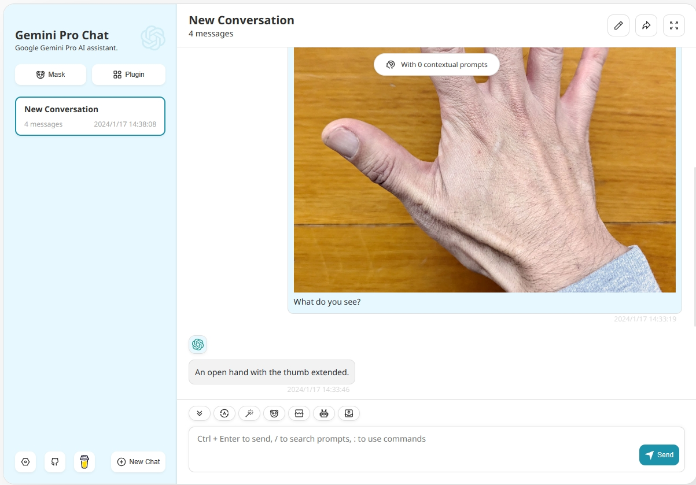

<div align="center">


<h1 align="center">Gemini Pro Chat</h1>

English / [简体中文](./README_CN.md)

One-Click to get a well-designed cross-platform Gemini web UI, Gemini Pro support, Base From [ChatGPT Next Web.](https://github.com/Yidadaa/ChatGPT-Next-Web/) 

一键免费部署你的跨平台私人 Gemini 应用, 支持Gemini Pro 模型。基于 [ChatGPT Next Web.](https://github.com/Yidadaa/ChatGPT-Next-Web/) 

[Web App](https://chat.googlegemini.co/) / [Twitter](https://twitter.com/xianyun88)

[网页版](https://chat.googlegemini.co/) / [反馈](https://github.com/lchh5/GeminiPro-Next-Web/issues)

[](https://vercel.com/new/clone?repository-url=https%3A%2F%2Fgithub.com%2Flchh5%2FGeminiPro-Next-Web&env=GOOGLE_API_KEY&project-name=geminipro-next-web&repository-name=GeminiPro-Next-Web)



</div>

## Features

- **Deploy for free with one-click** on Vercel in under 1 minute

- Google Gemini Pro Support,include Text Input and Text Image Input.
- Privacy first, all data is stored locally in the browser
- Markdown support: LaTex, mermaid, code highlight, etc.
- Responsive design, dark mode and PWA
- Fast first screen loading speed (~100kb), support streaming response
- New in v2: create, share and debug your chat tools with prompt templates (mask)
- Awesome prompts powered by [awesome-chatgpt-prompts-zh](https://github.com/PlexPt/awesome-chatgpt-prompts-zh) and [awesome-chatgpt-prompts](https://github.com/f/awesome-chatgpt-prompts)
- Automatically compresses chat history to support long conversations while also saving your tokens
- I18n: English, 简体中文, 繁体中文, 日本語, Français, Español, Italiano, Türkçe, Deutsch, Tiếng Việt, Русский, Čeština, 한국어, Indonesia


## 主要功能

- 在 1 分钟内使用 Vercel **免费一键部署**
- Google Gemini Pro 支持,支持文本交互和图像识别交互.
- 完整的 Markdown 支持：LaTex 公式、Mermaid 流程图、代码高亮等等
- 精心设计的 UI，响应式设计，支持深色模式，支持 PWA
- 极快的首屏加载速度（~100kb），支持流式响应
- 隐私安全，所有数据保存在用户浏览器本地
- 预制角色功能（面具），方便地创建、分享和调试你的个性化对话
- 海量的内置 prompt 列表，来自[中文](https://github.com/PlexPt/awesome-chatgpt-prompts-zh)和[英文](https://github.com/f/awesome-chatgpt-prompts)
- 自动压缩上下文聊天记录，在节省 Token 的同时支持超长对话
- 多国语言支持：English, 简体中文, 繁体中文, 日本語, Español, Italiano, Türkçe, Deutsch, Tiếng Việt, Русский, Čeština, 한국어, Indonesia
- 拥有自己的域名？好上加好，绑定后即可在任何地方**无障碍**快速访问


## Get Started

> [简体中文 > 如何开始使用](./README_CN.md#开始使用)

1. Get [GOOGLE_API_KEY](https://makersuite.google.com/app/apikey);
2. Click
   [](https://vercel.com/new/clone?repository-url=https%3A%2F%2Fgithub.com%2FYidadaa%2FChatGPT-Next-Web&env=OPENAI_API_KEY&env=CODE&project-name=chatgpt-next-web&repository-name=ChatGPT-Next-Web), remember that `CODE` is your page password;
3. Enjoy :)

## FAQ

[简体中文 > 常见问题](./docs/faq-cn.md)

[English > FAQ](./docs/faq-en.md)


## Environment Variables

> [简体中文 > 如何配置 api key、访问密码、接口代理](./README_CN.md#环境变量)


### `GOOGLE_API_KEY` (requird)

Google Gemini Pro Api Key.

### `GOOGLE_URL` (optional)

Google Gemini Pro Api Url.

## Requirements

NodeJS >= 18, Docker >= 20

## Development

> [简体中文 > 如何进行二次开发](./README_CN.md#开发)

Before starting development, you must create a new `.env.local` file at project root, and place your api key into it:

```
GOOGLE_API_KEY=<your api key here>

# if you are not able to access google gemini pro service, use this GOOGLE_URL
GOOGLE_URL=
```

### Local Development

```shell
# 1. install nodejs and yarn first
# 2. config local env vars in `.env.local`
# 3. run
yarn install
yarn dev
```

## Deployment

> [简体中文 > 如何部署到私人服务器](./README_CN.md#部署)

## Screenshots


## Translation

If you want to add a new translation, read this [document](./docs/translation.md).

## Donation

[Buy Me a Coffee](https://www.buymeacoffee.com/xianyun)

## LICENSE

[MIT](https://opensource.org/license/mit/)
